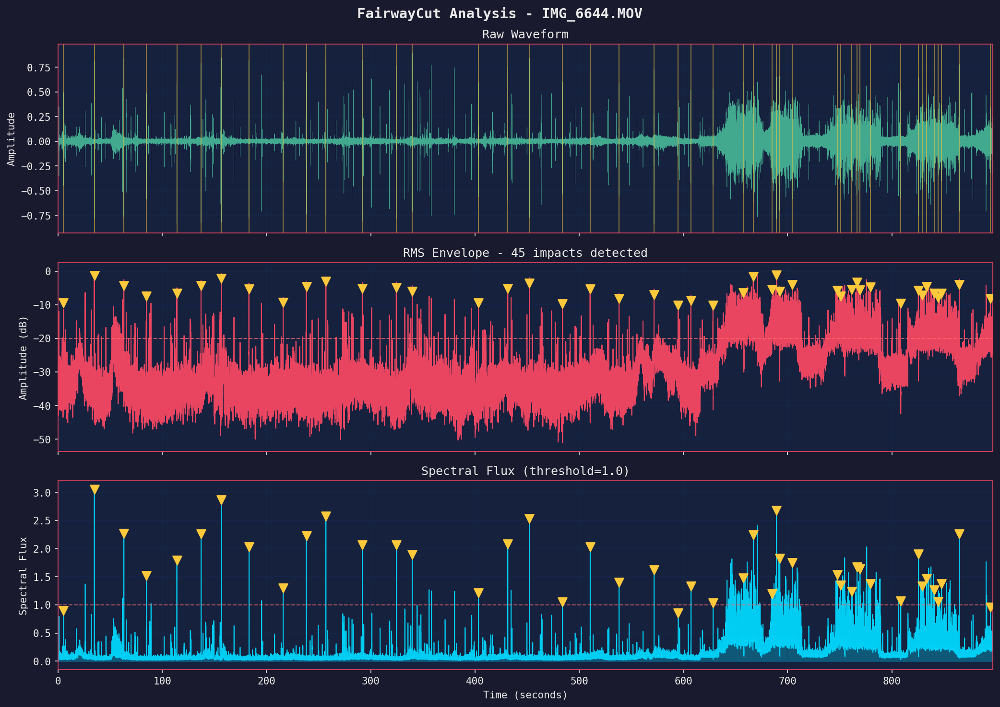
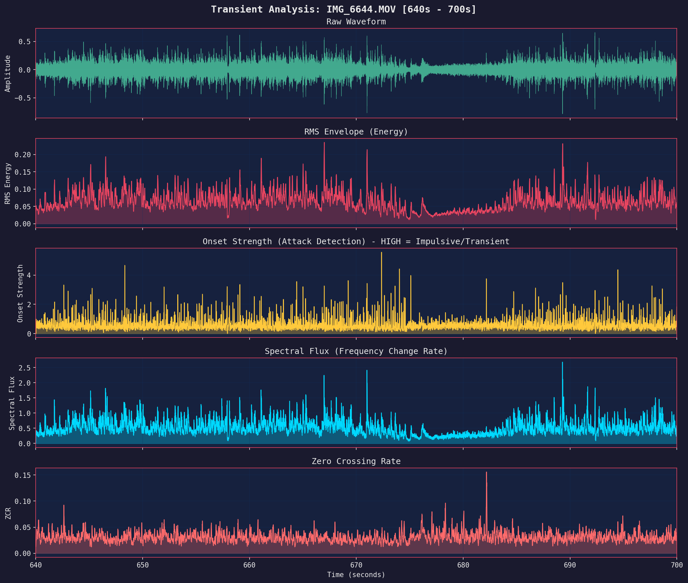

# FairwayCut


**Auto-cut golf videos into clean swing clips — open-source, accurate, and deterministic.**

FairwayCut is a local, offline command-line tool designed for golfers and developers. It automatically detects and extracts individual golf swings from continuous driving range videos without the need for manual editing or cloud processing.

## What It Looks Like

| Raw capture vs auto-cut clip with overlays |
| :---: |
|  |

## Audio Analysis

FairwayCut uses advanced audio signal processing to detect impact sounds. You can visualize this analysis using the `plot` command.

### Signal Analysis
The analysis plot visualizes the audio waveform and spectral flux used to detect candidate swings.



- **Waveform**: The raw audio signal amplitude.
- **Onset Strength**: The rate of change in the spectral magnitude, used to detect percussive events.
- **Candidates**: Red dashed lines indicate detected potential impacts based on adaptive thresholding.

### Transient Detail
The transient analysis provides a zoomed-in view of the spectral characteristics around a detected impact.



This visualization shows the spectrogram and flux around the impact, helping to verify the "sharpness" and spectral content of the sound (the "crack" of the club).

## Experimental: 3D Swing Export

FairwayCut can export individual swings as interactive 3D HTML visualizations. This allows you to rotate, zoom, and analyze the skeletal motion from any angle in your browser.


> [!WARNING]
> This feature is currently experimental. The coordinate mapping and visualizer UI may change in future versions.

To try it, use the `--export-3d` flag:
```bash
uv run fairwaycut extract input_video.mov --export-3d
```

## Key Features

- **Local & Privacy-Focused**: Runs entirely on your machine. No cloud uploads.
- **Deterministic by design**: Same input + same settings = the same clips every time.
- **Multi-modal detection**:
    - **Audio (transient + adaptive SNR)** finds candidate impacts.
    - **Pose (MediaPipe / Apple Vision)** validates each candidate as a binary gate — a candidate is dropped if its segment doesn't show a real swing-motion pattern.
- **Flexible modes**:
    - `audio` (fastest), `hybrid` (audio + targeted pose validator, recommended), `lite` (full video, lite pose), `full` (full video, high-accuracy pose).
- **Overlay visualizations**: pose skeleton (purple bones, neon-green wrists with a fading trail), liquid-glass wrist-speed HUD with a live sparkline, and audio waveform strip — pick any combination per clip.

## Installation

**Prerequisites**:
- Python 3.11 or higher
- [ffmpeg](https://ffmpeg.org/) (required for video processing)

Install via `pip` or `uv` (recommended):

```bash
# Install from source
git clone https://github.com/itspalomo/fairwaycut.git
cd fairwaycut
uv sync
```

### Apple Silicon Acceleration
On supported macOS systems, Apple Vision dependencies install automatically during
`uv sync` and FairwayCut will route pose estimation to Apple Vision by default.
Other platforms continue to use MediaPipe automatically.

## Quick Start

1.  **Extract Swings**: The most common use case.
    ```bash
    uv run fairwaycut extract input_video.mov --output-dir ./swings --mode hybrid
    ```

2.  **Export overlay clips** (spot-check detections visually).
    ```bash
    # Render every overlay component
    uv run fairwaycut extract input_video.mov --mode hybrid --with-overlays all

    # Or pick a subset
    uv run fairwaycut extract input_video.mov --mode hybrid --with-overlays pose,hud
    ```
    Components: `pose`, `hud`, `waveform`, `timestamp` (or `all`).

3.  **View Help**:
    ```bash
    uv run fairwaycut --help
    ```

## Command Reference

### `extract`
Detects swings and saves them as individual video files.

```bash
fairwaycut extract <VIDEO_PATH> [OPTIONS]
```
- `--mode`: `audio` (fast), `hybrid` (accurate), `lite`, or `full`.
- `--pre-impact`: Seconds to include before impact (default: 3.0).
- `--post-impact`: Seconds to include after impact (default: 2.0).
- `--with-overlays`: Comma-separated overlay components or `all`. Choices:
    - `pose` — purple skeleton with neon-green wrists and fading trail
    - `hud` — frosted-glass wrist-speed panel (current + peak m/s + sparkline) and the MediaPipe Pose badge
    - `waveform` — audio waveform strip below the frame
    - `timestamp` — elapsed-time readout

### `analyze`
Detects swings and prints a text report without saving videos. Good for testing parameters.

```bash
fairwaycut analyze <VIDEO_PATH>
```

### `plot`
Generates a matplotlib figure showing audio analysis and detection signals.

```bash
fairwaycut plot <VIDEO_PATH>
```

## How It Works (High Level)

- **Audio transient analysis**: We measure spectral flux + onset strength and gate peaks using adaptive, local SNR. This catches the sharp “crack” of impact while ignoring crowd noise, music, or HVAC hum.
- **Pose-as-validator (hybrid mode)**: Around each audio candidate we run MediaPipe (or Apple Vision on macOS) and ask one binary question — *did a real swing actually happen here?* The answer is based on peak wrist speed and the presence of the backswing/downswing/impact phase pattern. Pose does **not** weight or boost the candidate's score; it can only veto it.
- **Audio-confidence floor**: Surviving candidates also have to clear a minimum audio confidence so loud non-impact sounds (claps, ball bounces, dropped clubs) don't sneak through on incidental motion.
- **Determinism**: Fixed seeds, stable thresholds, and ordered fusion rules guarantee repeatable results.

For deeper details, see `docs/ARCHITECTURE.md`.

## Roadmap

- [ ] Batch processing for multiple files
- [ ] Advanced swing phase analysis (Top of Backswing, Address, Finish)
- [ ] Ball flight tracking

## Contributing

We welcome unique contributions! Please see [CONTRIBUTING.md](CONTRIBUTING.md) for details on how to set up your development environment and submit pull requests.

## License

MIT License. See [LICENSE](LICENSE) for details.
