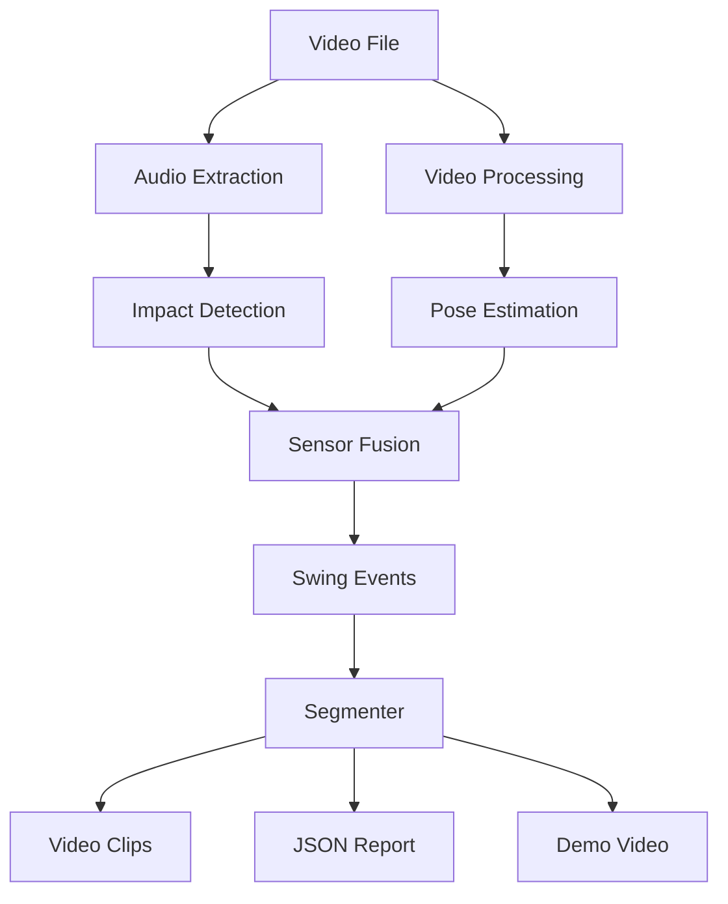

# System Architecture

## Overview

FairwayCut follows a modular pipeline architecture designed for local, deterministic video processing. The system ingests a video file, processes audio and visual signals in parallel, and fuses them to detect golf swings.

## Core Components

### 1. Audio Analysis (`fairwaycut.audio`)
Responsible for detecting the "crack" of the club hitting the ball.
- **Extraction**: Uses `ffmpeg` (via `moviepy`) to extract raw audio.
- **Detection**: Adaptive signal-to-noise ratio (SNR) algorithms identify transient peaks.
- **Key Function**: `detect_impacts_adaptive_snr`

### 2. Pose Estimation (`fairwaycut.pose`)
Abstracts over different computer vision backends to detect golfer pose.
- **Backends**:
    - **MediaPipe**: Cross-platform, CPU-based.
    - **Apple Vision**: macOS specific, hardware accelerated (CoreML/Neural Engine).
- **Key Classes**: `PoseEstimator` (protocol), `MediaPipeEstimator`, `AppleVisionEstimator`.

### 3. Sensor Fusion (`fairwaycut.fusion`)
The brain of the operation. It correlates high-confidence audio impact timestamps with visual pose data (e.g., checking if a person is in a "swinging" pose at the time of the sound).
- **Logic**:
    1. Start with audio impacts (fast).
    2. For each impact, check pose in a small window (efficient).
    3. Filter out false positives (e.g., impact sound but no golfer).
- **Key Function**: `detect_swings` inside `detector.py`

### 4. Configuration & Models (`fairwaycut.core`)
Defines the shared data structures and validation rules.
- **Models**: `SwingEvent`, `DetectionResult`, `FramePose`.
- **Config**: Pydantic-based configuration management (`Config` class).

## Data Flow

1.  **Ingest**: CLI accepts video path and parameters.
2.  **Audio Pass**: Entire audio track is scanned for candidate timestamps.
3.  **Visual Pass**:
    - **Hybrid Mode**: Only frames around candidate timestamps are processed for pose.
    - **Full Mode**: Every frame is processed (slower, but doesn't rely on audio).
4.  **Fusion**: Candidates are validated and merged into unique swing events.
5.  **Output**:
    - **Extract**: `moviepy` cuts the original video at event boundaries.
    - **Report**: JSON dump of `DetectionResult`.

## Design Principles

- **Immutability where possible**: Passing data classes rather than mutating state.
- **Determinism**: Fixed seeds and deterministic algorithms ensure reproducibility.
- **Fail-fast**: Validation happens at the config/CLI level before expensive processing.
