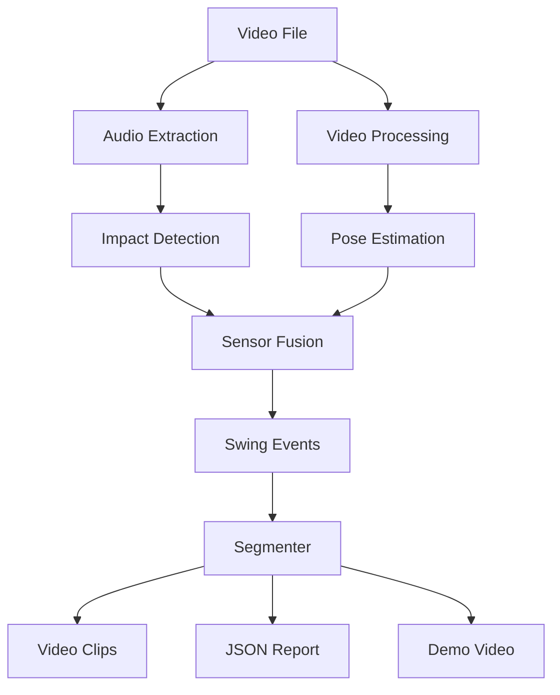

# System Architecture

## Overview

FairwayCut follows a modular pipeline architecture designed for local, deterministic video processing. The system ingests a video file, processes audio and visual signals in parallel, and fuses them to detect golf swings.

## Core Components

### 1. Audio Analysis (`fairwaycut.audio`)
Responsible for detecting the "crack" of the club hitting the ball.
- **Extraction**: Uses `ffmpeg` (via `moviepy`) to extract raw audio.
- **Transient analysis**: Spectral flux + onset strength identify sharp, broadband changes that match impact transients, while RMS is used to reject sustained hums.
- **Adaptive SNR**: Each candidate peak is compared to a rolling median background window, so thresholds rise automatically in noisy bays and drop in quiet bays.
- **Key Function**: `detect_impacts_adaptive_snr`

### 2. Pose Estimation (`fairwaycut.pose`)
Abstracts over different computer vision backends to detect golfer pose.
- **Backends**:
    - **MediaPipe**: Cross-platform, CPU-based.
    - **Apple Vision**: macOS specific, hardware accelerated (CoreML/Neural Engine).
- **Key Classes**: `PoseEstimator` (protocol), `MediaPipeEstimator`, `AppleVisionEstimator`.

### 3. Sensor Fusion (`fairwaycut.fusion`)
The brain of the operation. It correlates high-confidence audio impact timestamps with visual pose data (e.g., checking if a person is in a "swinging" pose at the time of the sound).
- **Logic**:
    1. Start with audio impacts (fast, deterministic anchor).
    2. For each impact, sample pose inside a configurable pre/post impact window.
    3. Score swing phases and blend audio + pose confidence (default 60/40).
    4. Drop swings below a minimum combined confidence or outside the time window.
- **Key Function**: `detect_swings` inside `detector.py`

### 4. Configuration & Models (`fairwaycut.core`)
Defines the shared data structures and validation rules.
- **Models**: `SwingEvent`, `DetectionResult`, `FramePose`.
- **Config**: Pydantic-based configuration management (`Config` class).

## Data Flow

1.  **Ingest**: CLI accepts video path and parameters.
2.  **Audio Pass**: Entire audio track is scanned for candidate timestamps.
3.  **Visual Pass**:
    - **Hybrid Mode**: Only frames around candidate timestamps are processed for pose.
    - **Full Mode**: Every frame is processed (slower, but doesn't rely on audio).
4.  **Fusion**: Candidates are validated and merged into unique swing events.
5.  **Output**:
    - **Extract**: `moviepy` cuts the original video at event boundaries.
    - **Report**: JSON dump of `DetectionResult`.

## Detection Approaches

### Audio transient analysis
- **Signals**: Spectral flux (primary) + onset strength + RMS envelope.
- **Transient filter**: Peaks must exceed flux and onset minimums, and pass an amplitude floor to reject wind/voice rumble.
- **Gap enforcement**: `min_gap_sec` ensures we do not double-count echoes or mat noise.

### Adaptive SNR gating
- **Local background**: Rolling median of spectral flux over `local_window_sec` establishes a noise floor per bay/scene.
- **SNR**: Peaks are accepted when `flux / local_background >= snr_threshold`.
- **Adaptive onset**: The minimum onset strength rises in quiet scenes and relaxes in noisy ones, keeping behavior stable across devices.
- **Function**: `detect_impacts_adaptive_snr` is the default detector in all CLI modes.

## Design Principles

- **Immutability where possible**: Passing data classes rather than mutating state.
- **Determinism**: Fixed seeds and deterministic algorithms ensure reproducibility.
- **Fail-fast**: Validation happens at the config/CLI level before expensive processing.

## Video & Visualization Pipeline

- **Segmentation**: Each fused `SwingEvent` defines `start_time`/`end_time` using configurable pre/post impact buffers.
- **Extraction**: `moviepy` writes individual swing MP4s; a manifest and JSON report are saved alongside clips.
- **Overlays**: The demo/overlay path renders pose skeletons, waveforms, timestamps, impact markers, and optional phase labels. Visualization presets control glow, trails, and depth coloring.
- **Modes**:
    - `audio`: audio-only overlays (fastest).
    - `segments` / `hybrid`: pose only around impacts (best speed/accuracy balance).
    - `lite` / `full`: full-video pose with lite/full MediaPipe models.

## Fusion Details

- **Weights**: Audio and pose confidence are blended (`audio_weight`/`pose_weight`, default 0.6/0.4).
- **Windows**: `pre_impact_sec` and `post_impact_sec` define both pose sampling windows and final clip boundaries.
- **Validation**: Swings below `min_combined_confidence` are dropped; phase timing (address → finish) is attached when pose data is available.
- **Determinism**: Fusion runs in timestamp order with stable weighting, so repeated runs with identical inputs produce identical outputs.
